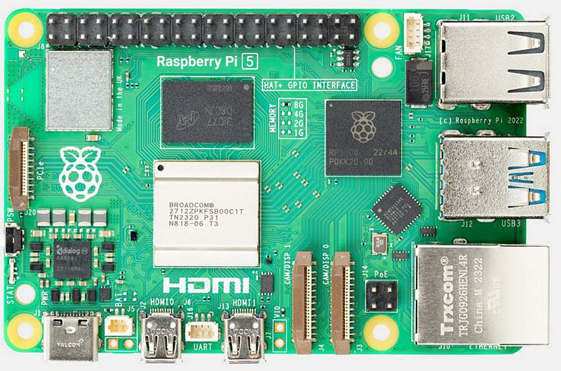

Raspberry Pi configuration
================================

Requirements
--------------------------

- Your dev PC connected to your home wifi network
- Your Raspberry Pi 5
- A 500Go external SSD drive

Configuration
--------------------------

Setup the SSD drive
__________________________

- Download `Raspberry Pi Imager <https://www.raspberrypi.com/software/>`_
- Select Raspberry Pi 5 as the Device
- Select "Other general purpose OS" -> "Ubuntu" -> "Ubuntu Server 24.04.3 LTS (64-bit)" as the OS
- Select your SSD drive as the storage device
- Chose **dragonfly** as the hostname
- Set the username to **dragonfly** and chose a password
- Keep the default settings for the wifi configuration, your Raspberry Pi will connect to your home wifi network
- Enable SSH and allow password authentication
- Click the write button and wait for the process to finish

First boot
__________________________

- Plug the SSD drive to your Raspberry Pi and power it on
- Power on the Raspberry Pi
- Find its IP address on your home router admin interface
- SSH into your Raspberry Pi from your dev PC
- Edit **/etc/netplan/50-cloud-init.yaml** to set a static IP address on your home network

.. code-block::

    network:
        version: 2
        wifis:
            wlan0:
            optional: true
            dhcp4: no
            addresses: [192.168.1.10/24]
            gateway4: 192.168.1.254
            nameservers:
                addresses: [1.1.1.1,8.8.8.8]
            regulatory-domain: "FR"
            access-points:
                "Freebox-70E8D0":
                auth:
                    key-management: "psk"
                    password: "12e99350af77b50358b8aeb360c63dbfd037c80635d5a11bd00c903bd72bd447"

- Apply the netplan configuration

.. code-block::

    sudo netplan apply

- SSH into your Raspberry Pi using its new static IP address

Setup hosts
__________________________

- Edit the **/etc/hosts** file to add the following line :

.. code-block::

    dev-pc 10.0.0.3

Install and setup Docker 
__________________________

- Follow this guide to install Docker on your Raspberry Pi : `Install Docker Engine on Ubuntu <https://docs.docker.com/engine/install/ubuntu/>`_
- To make sure you can use Docker without sudo

.. code-block::

    sudo usermod -aG docker $USER
    newgrp docker

- Créer le fichier /etc/docker/daemon.json et y écrire

.. code-block::

    {
        "insecure-registries" : [ "dev-pc:5000" ]
    }

Install and setup OpenVPN 
__________________________

- Install OpenVPN Client

.. code-block::

    sudo apt update
    sudo apt install openvpn

- Setup autostart

Uncomment the following line from **/etc/default/openvpn**

.. code-block::

    AUTOSTART="all"

- Download your .ovpn file from your OpenVpnAS instance on your Dev PC
- scp it in your Raspberry Pi under **/etc/openvpn/client.conf**

- Enable and start the OpenVPN service

.. code-block::

    sudo systemctl enable openvpn@client.service
    sudo systemctl start openvpn@client.service

Generate UDEV rules 
__________________________

When a USB device is plugged, it can be assigned to /dev/ttyUSB0, /dev/ttyUSB1, /dev/ttyUSB2...
UDEV rules allows you to chose the name of the file to which a device will be assigned, we need this so that our drivers can find their devices.

- Create the following file : **/etc/udev/rules.d/dragonfly.rules**
- Write the following content : 

.. code-block::

    KERNELS=="ttyUSB*", SYMLINK+="imu"
    KERNELS=="ttyACM*", SYMLINK+="gps"

- Run the following commands to apply the rules :

.. code-block::

    sudo udevadm control --reload-rules
    sudo udevadm trigger

Connect to your 4G dongle 
__________________________

TODO