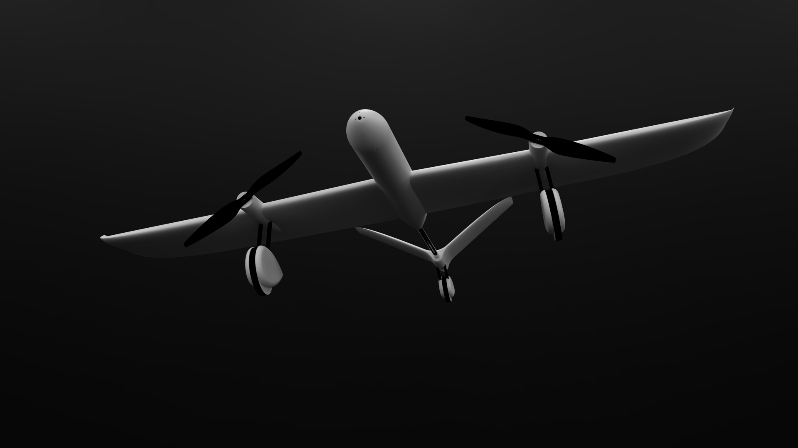
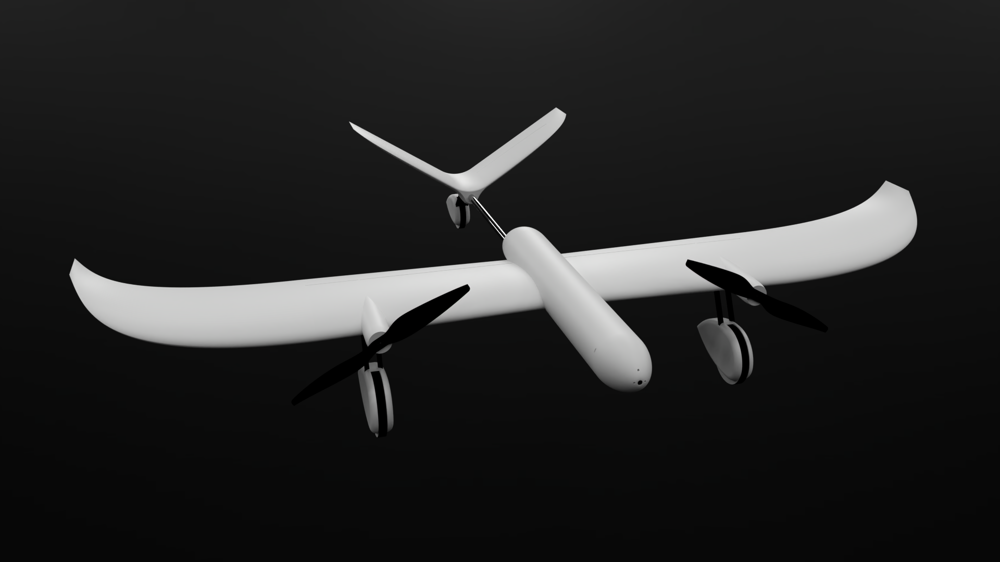
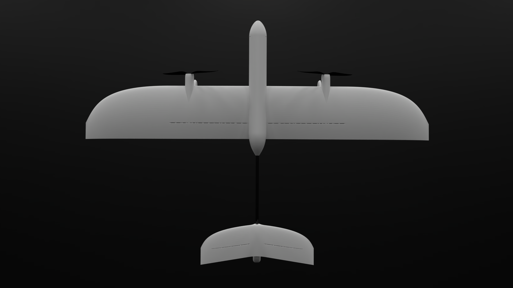
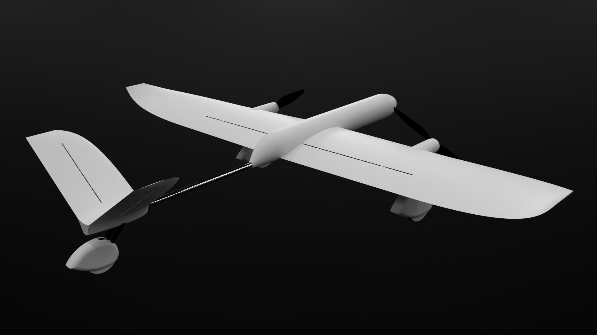
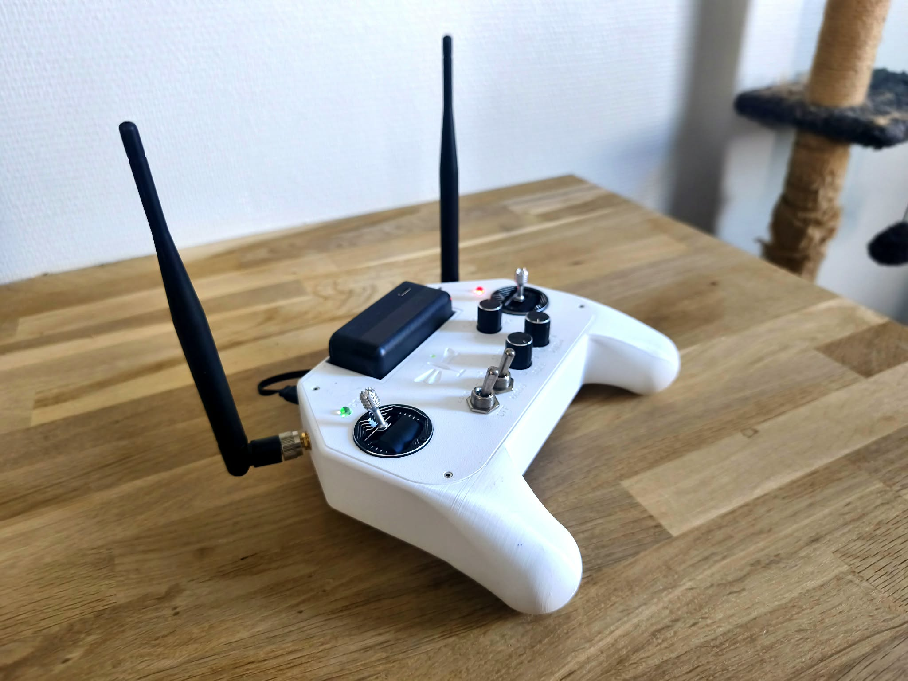

DragonFly
=====================================

DragonFly is an open source autonomous RC plane made from scratch. 
This repository contains all the software required to operate it as well as instructions for building your own !

.. toctree::
   :maxdepth: 1

   overview/index
   hardware/index
   software/index

