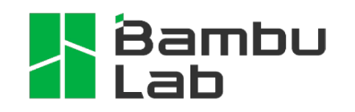

Project Overview
========================

.. warning::

    This project is still ongoing, and this page does not depict its current state. See the :doc:`Project Status <project_status/index>` page

DragonFly is an autonomous RC Plane designed for stability and efficiency. It can be manually operated using a Remote Control, or autonomously execute missions defined through an HMI.

.. toctree::
    :maxdepth: 1

    project_status/index
    system_architecture/index
    safety_considerations/index

Key Features
____________

- Long Range 
    - Tens of kilometers range via RF depending on line of sight
    - Basically infinite range via 4G
    - Endurance: about 1 hour
- Autonomy
    - Waypoint navigation
    - Autonomous takeoff and landing
- Open source
    - Everything (code, 3D models...) is available, and you are free to do whatever you want with it (please just don't turn it into a weapon)

.. image:: ../images/dragonfly_4.png

.. note::

    Building your own DragonFly is not a turnkey project, I made it as easy as possible to replicate, but you will still need the following :    
    
    - Basic skills in 
        - Linux
        - 3D Printing
        - Electronics (safety, soldering...)
        - DIY
        - Troubleshooting
    - Workshop equipment
        - A 3D printer that can print PETG
        - A soldering iron
        - Respiratory protection for carbon fiber dust
        - Basic workshop equipment (saws, pliers, screwdrivers...)
    - Budget
        - I estimate the total development cost to be around 2000€ (including the 700€ 3D Printer, but not including labor of course). You might be able to recreate it for less than 1000€ if you choose a cheaper 3D printer and buy less useless stuff than me 
    - Time
        - I estimate the total build time to be between one and a few months, assuming you can work on it every weekend and have a 3D printer running 24/7.

Technology Stack
------------------------------------

.. image:: ../images/github-pages.png
   :height: 60px

.. image:: ../images/docker.png
   :height: 60px

