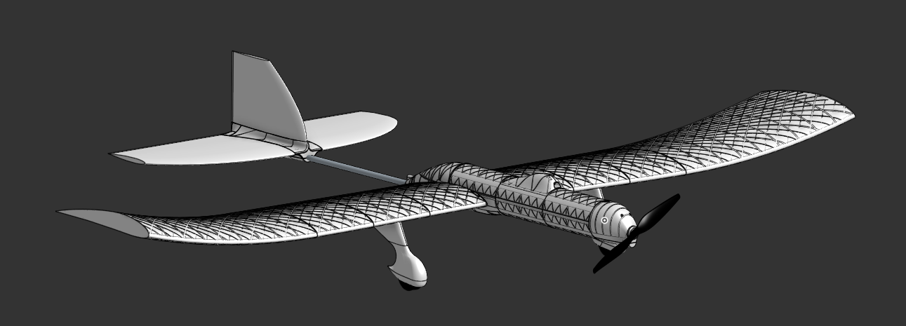
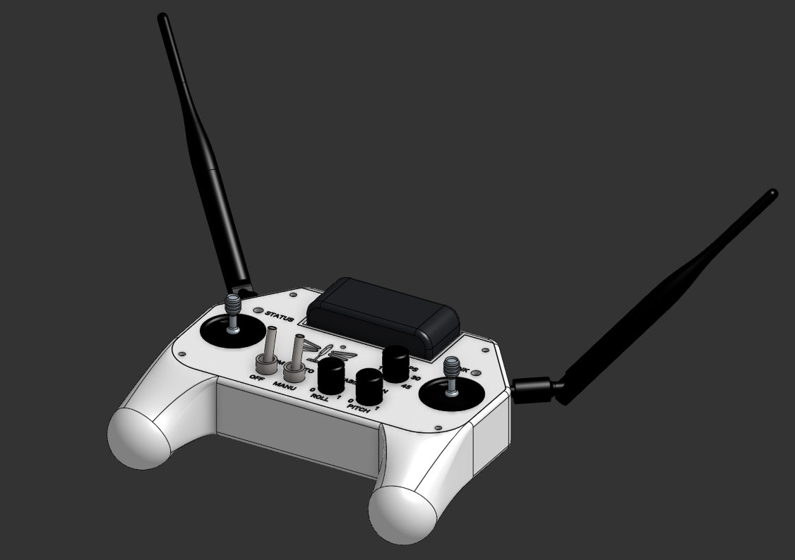
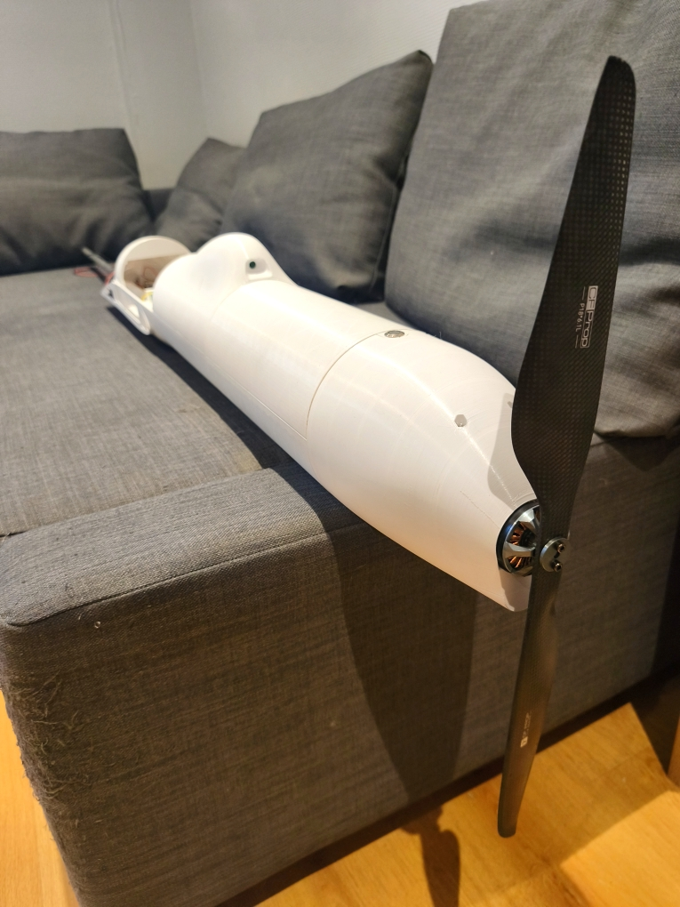
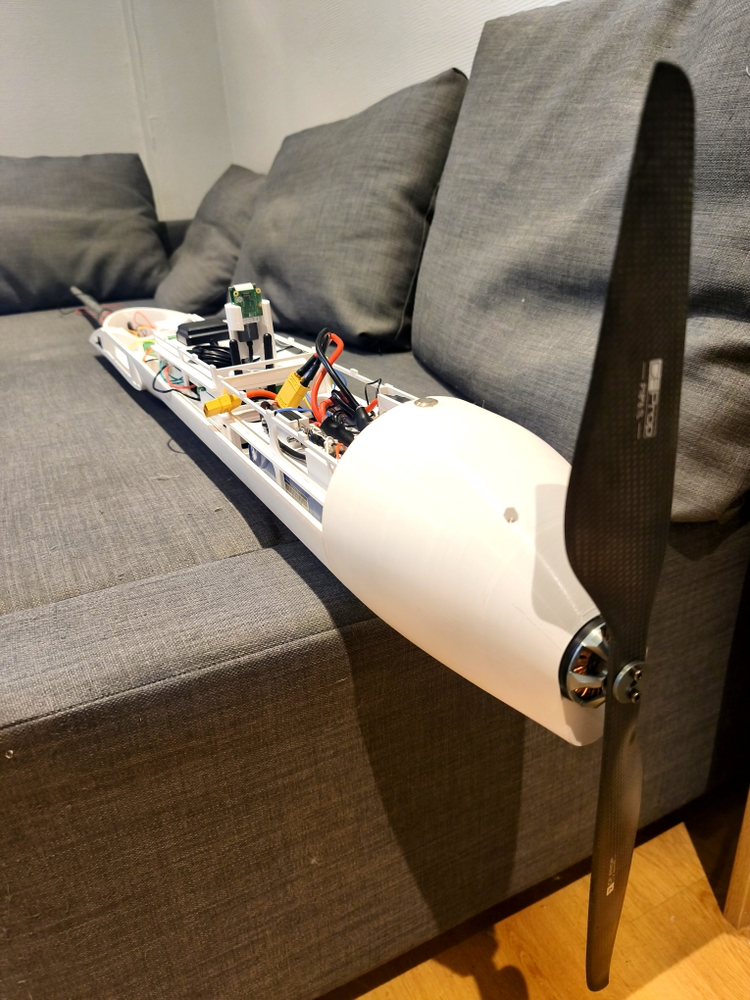

DragonFly Mk2
=============

Goals
_____

Create the first flight-worthy DragonFly iteration. Autonomous behaviour is still out of scope, but this iteration should be capable of manual flight.

- Mechanical design : 
    - Switch to OnShape for CAD
    - Strengthen the design by using both carbon fiber and PETG
    - Run the spars through the fuselage instead of having separate spars for each wing, and compensate the lack of dihedral angle by adding curvature to the wing tips
    - Improve aerodynamics and run aerodynamics simulations to check lift and drag are within the expected margins.
    - No longer use heat-shrink covering, use full 3D printed parts instead, it is much easier and not much heavier.

- Electronics design : 
    - Create a more densely packed design, while keeping it easy to work with and disassemble
    - Add a backup IMU
    - Add a long-range RF Modem to add communication redundancy
    - Add a raspberry Pico as the flight controller, keep the Raspberry Pi 5 as a Payload Computer (it is still needed for 4G and videostreaming)
    - Separate the 5V equipments into 3 buses : electronics, modems (RF, 4G), and servos to avoid noise on the bus

- Software : 
    - Stop using ROS and get familiar with bare-metal dev
    - Unit test the Flight Controller and Remote Control code as much as possible
    - Do not use dynamic allocations in the Flight Controller and the Remote Control

- Remote Control :
    - Design my own remote control, it must be usable without being connected to the ground computer (powered via a battery, communicates via RF)

Outcome
_______

.. image:: /images/remote_control.jpg
    :width: 600px

I probably could have gone through with this iteration, but I had this idea in the back of my mind that i should design a PCB to fit all the electronics. 
One day, the urge to learn something new got to me and I started designing the said PCB. I quickly realised what an improvement it would be in terms of safety and compactness. It would allow me to reduce the wingspan from 3m to 2m.
I also had ideas of sensors that i would like to add but that did not fit the current design and would easily fit on a PCB.

So i decided to go for a third (and hopefully last) iteration.

**What I learned**

- Mechanical design : 
    - Onshape is great ! Fast and intuitive.
    - I built the whole fuselage and encountered no issue. Most of the design seems good and can be reused for the next iteration
- Electronics design : 
    - I planned to use a smart power switch to turn the power on and off. This switch turned out to be very unreliable and it almost blew up my ESC by turning on and off repeatedly for no reason, so i decided to simply disconnect the battery instead of having a switch
    - The electronics were functional (though i did not have the opportunity to test them under full motor and servos load)
    - Designing a simple PCB is not that hard
- Software :
    - The Raspberry Pico is great ! It is easy to flash and the sdk is easy to use and well documented
    - The RF bandwidth is smaller than expected, I had to redesign my communication protocol
- Remote Control :
    - Everything went well, the remote control is functional and i can keep it as is (Unless the urge to create a PCB for it gets to me)

