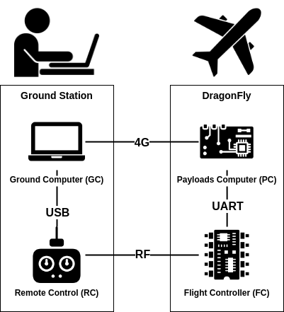

Communication
------------------------------------

The DragonFly system is composed of 4 nodes that can communicate with one another via different links

The diagram above shows that : 

- Not all nodes are directly linked, so the nodes will need to forward data
- Every node is connected to every other node by two paths, this gives us redundancy

The dragonfly_datagram_protocol Library
=======================================

This library implements the following for the nodes : 

- Transport of datagrams over stream-like links
- Data forwarding for datagrams that are not addressed to the node
- Best link selection when two links are available to send data to another node

.. note:: This library uses no dynamic allocation as it is used inside critical components (RC and FC)

Communication guarantees
________________________

To simplify, we will assume that the links between the nodes only guarantee the ordering of the data (this is the only guarantee they all provide).

This protocol only guarantees data integrity, and duplicate-free delivery.

Datagrams may :

- Never arrive
- Not arrive in order (when switching between links)

But they may not :

- Arrive twice or more
- Be corrupted (except in very rare cases when the CRC-16 remains valid after a corruption, but this can be ignored)

Protocol
________________________

Each datagram is encapsulated into one or many packets with the following format : 

==========  =============   ===========
Field       Size (bytes)    Description
==========  =============   ===========
MAGIC 'D'   1               The 'D' character (0x44)
MAGIC 'P'   1               The 'P' character (0x50)
Src / Dst   1               Least significant 4 bits : source of the packet, most significant 4 bits : destination of the packet
Size        1               The packet size in bytes
Sequence    1               Least significant 4 bits : last sequence index, most significant 4 bits : index in sequence (starting at 0)
Payload     Size            The packet payload
CRC-16      2               CRC-16 checksum (calculated on the payload, including previous packets from the sequence)
==========  =============   ===========

- The first two bytes are **MAGIC** bytes that allow the protocol to find the beginning of a packet in the rx stream
- The **Src/Dst** byte allows the protocol to know wether the packet should be forwarded or not, and the application to know where the packet comes from
- The **Sequence** byte allows the protocol to defragment datagrams that have been sent over multiple packets
- The **CRC-16** bytes allow the protocol to guarantee the integrity of the data, it is calculated over the full payload so that the protocol can detect that some packets were missing if it receives the expected sequence number, but from another datagram

Implementation
________________________

The implementation takes advantage of the symetry of the system, each node has :

- A local link (the UART link to PC for FC)
- A remote link (the RF link to RC for FC)
- A local peer (PC for FC)
- A direct remote peer (RC for FC)
- An indirect remote peer (GC for FC)

The links are abstracted behind an interface (**IoInterface** from rpi_pico_utils)

Data forwarding
________________________

Data forwarding is quite simple, if a node receives a datagram that is not addressed to him on its local link, he forwards it on its remote link, and the other way around  

Best Link Selection
________________________

The protocol periodically sends **Ping** datagrams and receives **Pong** datagrams to/from all the peers via all the links.
Those messages are used to compute the packet loss and latency of communication with every remote node through every link.

The protocol decides to switch links if the packet loss and latency of the current link becomes worse by a sufficient margin.

.. note:: Only the local link can be used to communicate with the local peer

The dragonfly_msgs Library
=======================================

This library generates c++ code from **.msg** files that describe the contents of a message. The generated code contains a class for each message that has serialisation and deserialisation methods. 

All datagrams sent over the **dragonfly_datagram_protocol** originates from one of these messages.

.. note:: This library uses no dynamic allocation as it is used inside critical components (RC and FC)